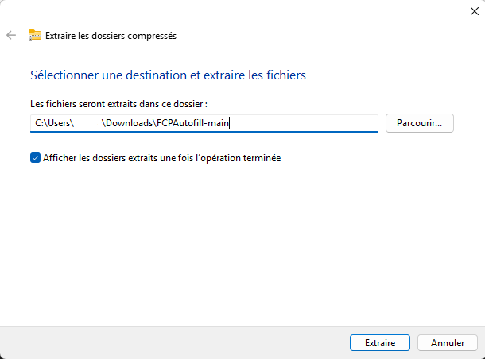

# FCP auto fill

## Introduction
FCP auto fill est une extention chrome permettant de remplir automatiquement les FCP (feuilles de suivi et de formations McDonald's). Cette extention permet un gain de temps conséquant car elle permet de cocher toutes les cases instantanément.

## Instalation
### 1 - Télécharger l'extension

Cliquez sur le bouton vert **Code** puis **Download ZIP** afin de lancer le téléchargement

## 2 - Décompresser l'extension

Localisez le dossier **.ZIP** que vous venez de télécharger décompréssez le (clic droit > Extraire Tout)

Choissisez et copiez une destination pour la décompression du dossier.
*Ici C:\Users\   \Downloads\FCPAutofill-main*

## 3 - Installation dans le navigateur
Ouvrez votre navigateur et rendez vous a l'adresse suivante :

``nom-du-navigateur://extensions``

*Par exemple ``chrome://extensions`` si chrome est votre navigateur*

Cliquez sur **Charger l'extension non empactée** en haut a gauche de la fenêtre.

Retournez sur le dossier **décompréssé** puis cliquez sur **sélectionner le dossier**. L'extension devrait apparaitre au coté des autres installlées sur votre navigateur.

## 4 - Utiliser l'extension
Lorsque vous vous trouvez sur une FCP il suffit d'ouvrir l'extension *(methode propre à chaque navigateur, souvent représentée par une pièce de puzzle)*. Le bouton rouge apparait, il suffit de cliquer dessus pour cocher automatiquement les cases.

⚠️ Attention au chargement de la page, ci celui ci est incomplet cela peut ne valider que la moitié des cases. Dans ce cas la, rafraichir la page est cliquez a nouveau sur le bouton rouge lorsque tout est chargé *~2-5s* ⚠️